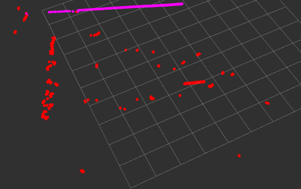

# Laser    

## Brief Description
A ROS package to fit a 2D laser data of containing a wall with a line segment.         
+ Inputs:   
    - /base_scan: 2D laser scan
             
+ Outputs:       
    - /hackathon/laser_debug: within debug mode, separate points on the wall with other points           
    - /hackathon/laser:          
        * range (rng), angle parameterization of line with respect to the laser coordinate system      
        * rng: float64, [-inf, +inf]         
        * angle: float64, [0, pi]      
        * left_rng: float64, distance to the left point of the line segment        
        * right_rng: float64, distance to the right point of the line segment       


## Instructions to use this node:


1. Navigate to the root of the workspace and build the workspace with
```
$ cd catkin_ws 
$ source devel/setup.bash or source devel/setup.zsh
$ catkin_make
```
2. Play the recorded dataset in a loop
```
$ rosbag play src/laser/dataset/2018-09-28-17-39-40-wall.bag -l
```
3. Run the rosnode in debug mode
```
$ rosrun laser laser --debug
```
4. Run Rviz for visualization
```
$ rviz
```
5. In Rviz
Fixed Frame: laser_link
LaserScan: /hackathon/laser_debug

## For unittest:
```
$ python src/tests/test_laser.py
```

## Results
<p align="center">
  
</p>